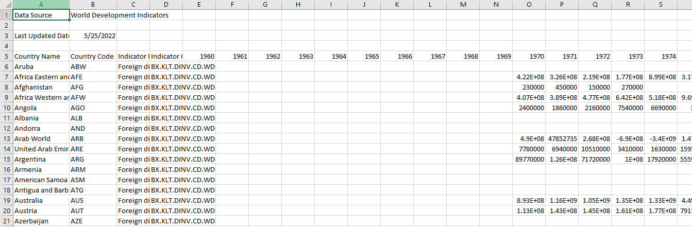
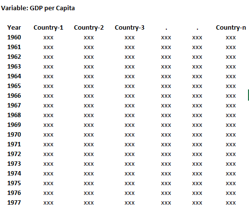
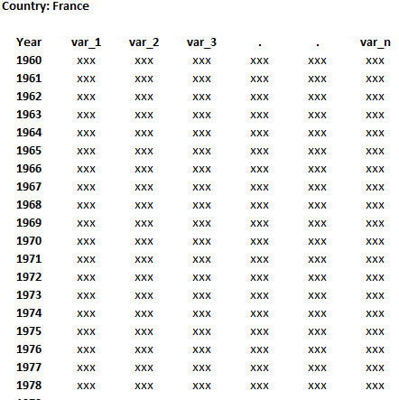
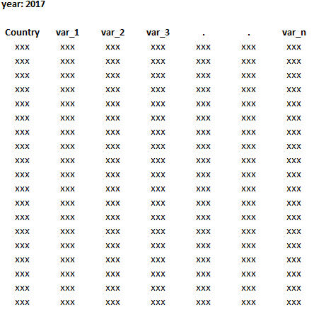

# World Bank Data Query Tool
* Multi csv files
* Transform and Visualize World Bank Data Indicator
  * Panel Data
  * Time Series Data (multi variables)
  * Cross Section Data (multi variables)
* Time Series Plot
* Boxplot
* Heatmap

## Requirements
* python 3.9.12
* pandas 1.4.2
* matplotlib 3.5.1
* seaborn 0.11.2

## WorldBankDataTransform

Standard data.worldbank.org/indicator data form

#### .countries_panel_data(key_name, country_list, save_file=False, filename_save=None )

transformed to:

#### .multivar_time_series(country, save_file=False, filename_save=None)

transformed to:

#### .multivar_cross_section(year, country_list=None, save_file=False, filename_save=None)

transformed to:

# Go ahead and
## Read example.py!
